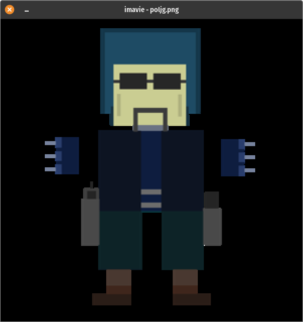

# imavie
## [clivie](https://github.com/ferhatgec/clivie) + [stb](https://github.com/nothings/stb)

 

```
external requirements:

sdl2
elite (for build)
c++ compiler (c++17 or higher required)

then:
elite Elitefile install
```

### imavie licensed under the terms of MIT License.
